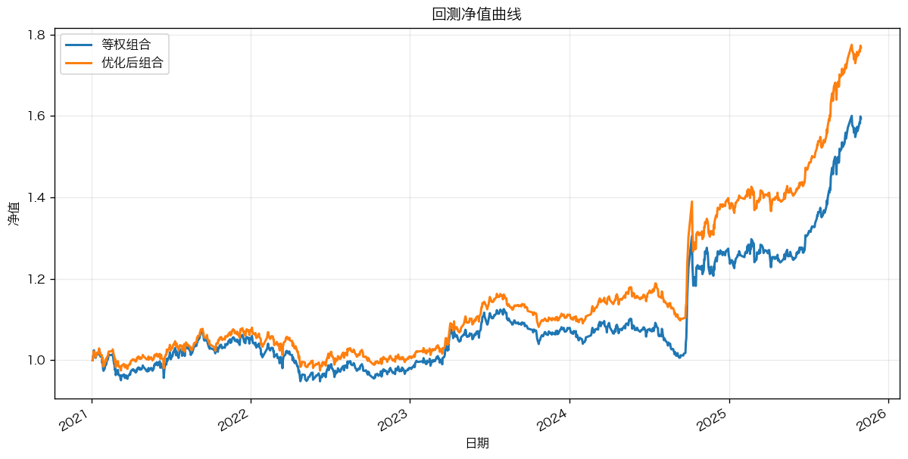
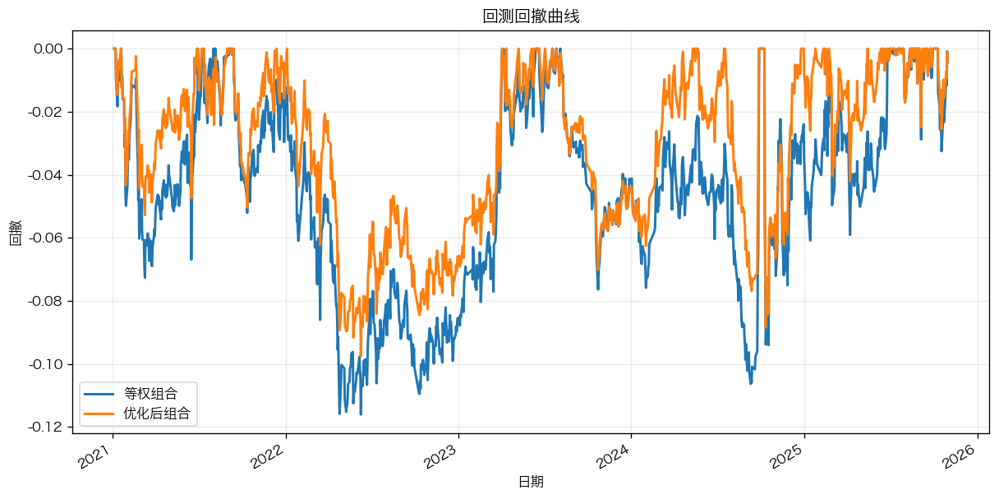

# 项目介绍

基于多因子选股 + 周度调仓的 ETF 组合回测框架，支持单因子 IC/IR 检验、因子合成、等权/风险平价权重与宏观 Regime 仓位调节。回测期、手续费、持仓约束等符合赛题要求（回测起始 2021-01-04，手续费万 2.5，单只 ≤35%，至少 3 只 ETF）。

---

## 目录结构

```
qfcomp/
├── config/           # 全局配置（路径、回测参数、因子列表等）
│   ├── base.py
│   └── __init__.py
├── data_loader/      # 数据加载与对齐，调仓日计算
│   ├── loader.py
│   └── __init__.py
├── factors/          # 因子计算、单因子测试、因子合成
│   ├── calc.py       # 因子计算与截面标准化
│   ├── library.py    # 因子定义与计算逻辑
│   ├── testing.py    # Rank IC、ICIR、p 值、有效因子筛选
│   ├── combine.py    # 滚动 IC/ICIR 加权合成
│   └── __init__.py
├── portfolio/        # 组合构建与仓位调节
│   ├── optimizer.py  # 协方差估计、最小方差、风险平价
│   ├── regime.py     # 宏观 Regime 仓位系数
│   └── __init__.py
├── backtest/         # 回测引擎（bt）、净值与绩效
│   ├── engine.py
│   └── __init__.py
├── pipelines/        # 主流程入口
│   ├── run_main.py   # 一键全流程
│   └── __init__.py
├── README.md         # 本说明
└── __init__.py
```

---

## 主流程（run_main）

从 `python -m qfcomp.pipelines.run_main` 运行后，按顺序执行：

| 步骤 | 内容 |
|------|------|
| 1 | **数据加载**：量价、宏观、产品池 → 对齐宽表、收盘价矩阵 |
| 2 | **因子计算与预处理**：全量因子计算，截面 rank 标准化 |
| 3 | **单因子测试**：Rank IC、ICIR、p 值；按**回测前样本**筛选有效因子（防前视） |
| 4 | **因子合成**：有效因子滚动 ICIR 加权 → 合成因子序列 (date×sec) |
| 5 | **宏观 Regime**：F01–F06 仓位信号 → 仓位系数序列 |
| 6 | **调仓计划**：等权 + 风险平价两种计划，并乘以仓位系数 |
| 7 | **回测**：bt 引擎、净值、绩效指标、净值/回撤曲线图 |

每次运行会在 `outputs/` 下生成**时间戳子目录**，当次所有结果与图片均保存在该目录内。

---

## 配置要点（config/base.py）

- **回测**：`BACKTEST_START = "2021-01-04"`，`TRANSACTION_COST = 2.5/10000`，`TOP_N = 5`，`MAX_SINGLE_WEIGHT = 0.35`，`MIN_HOLDINGS = 3`
- **因子**：`FORWARD_RETURN_PERIODS = [5]`（约一周），`COMBINE_METHOD = "icir"`，`COMBINE_ROLLING_WINDOW = 60`
- **有效因子筛选**：回测前样本上 `|mean_IC| > 0.02` 且 `p_value ≤ 0.05`

---

## 一次运行的结果示例

以下为一次完整运行的结果目录 **`outputs/20260216_130535/`** 中的文件及含义。

### 1. 单因子测试结果（回测前样本）

**文件**：`单因子测试结果.csv`

各截面因子的 Rank IC 统计（仅使用回测起始日之前的样本，用于筛选与合成）：

| 列名 | 含义 |
|------|------|
| factor | 因子代码（如 A01, B01） |
| period | 收益周期（ret_5d） |
| mean_ic | IC 均值 |
| std_ic | IC 标准差 |
| icir | IC 信息比率 = mean_ic / std_ic |
| p_value | 双侧 t 检验 p 值（H0: IC 均值=0） |
| win_rate | IC > 0 的占比 |
| count | 有效观测数 |
| sig_05 / sig_01 | 是否在 5%/1% 水平显著 |

有效因子筛选条件：`|mean_ic| > 0.02` 且 `p_value ≤ 0.05`。

---

### 2. 有效因子列表

**文件**：`有效因子.csv`

当次通过筛选的因子名列表（一列「因子」），用于因子合成与选股。示例中为：A01, A02, A05, A06, B01, B03, B05, B06, C03, D01, D02, D04, T01 等。

---

### 3. 合成因子序列

**文件**：`合成因子序列.csv`

长表格式 `(date, sec, composite_score)`，为每日每只 ETF 的合成因子得分（截面排序百分位 [0,1]），供调仓时选 Top N 使用。

---

### 4. 宏观仓位系数

**文件**：`宏观仓位系数.csv`

按日记录的 Regime 仓位系数 `position_scale`，用于对等权/风险平价权重做整体缩放（余量为现金）。

---

### 5. 净值序列

**文件**：`等权组合_净值序列.csv`、`优化后组合_净值序列.csv`

两列：`date`、`nav`（归一化净值，回测期起始为 1.0）。

---

### 6. 绩效汇总

**文件**：`绩效汇总.csv`

各策略的绩效指标，示例（数值为当次运行结果）：

| 策略 | 年化收益 | 年化波动 | 夏普 | 最大回撤 | 累计收益 | Calmar |
|------|----------|----------|------|----------|----------|--------|
| 等权组合 | ~10.15% | ~12.27% | ~0.83 | ~-11.61% | ~59.35% | ~0.87 |
| 优化后组合 | ~12.55% | ~11.14% | ~1.13 | ~-9.76% | ~76.78% | ~1.29 |

---

### 7. 回测曲线图

**文件**：`回测净值曲线_<时间戳>.png`、`回测回撤曲线_<时间戳>.png`

- **净值曲线**：等权组合 vs 优化后组合的净值走势。
- **回撤曲线**：各策略的净值回撤（相对前高点的跌幅）随时间变化。

示例（来自 `outputs/20260216_130535/`）：

**回测净值曲线**



**回测回撤曲线**



---

## 如何运行

在项目根目录下（确保已安装依赖，如 `bt`、`pandas`、`scipy` 等）：

```bash
# 推荐：使用 conda 环境
conda activate <your_env>
python -m qfcomp.pipelines.run_main
```

输出目录为 `outputs/<YYYYMMDD_HHMMSS>/`，当次所有 CSV 与图片均在该目录下。

---

## 依赖

- Python 3.8+
- pandas, numpy, scipy
- bt（回测库）
- matplotlib（出图）
- openpyxl（读 Excel 产品池）

路径与数据文件在 `config/base.py` 中配置，默认从项目根目录的 `data/` 读取附件数据。
